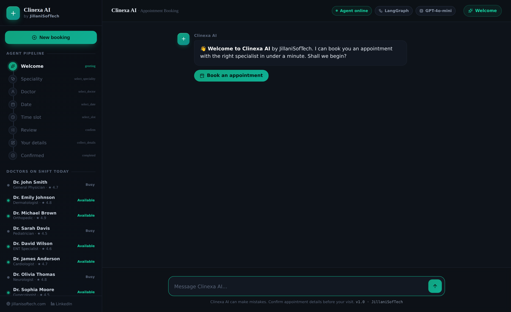
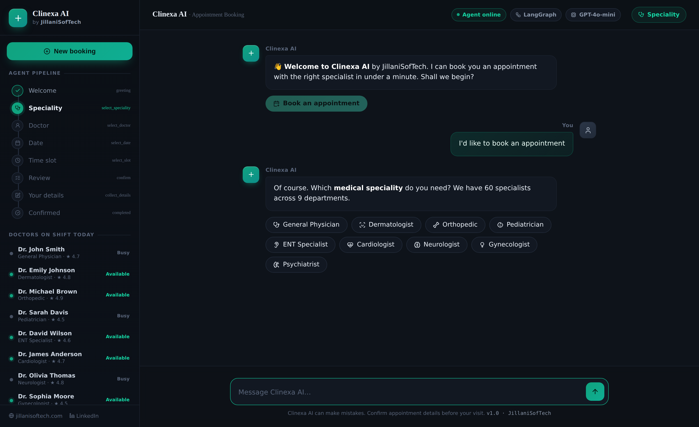
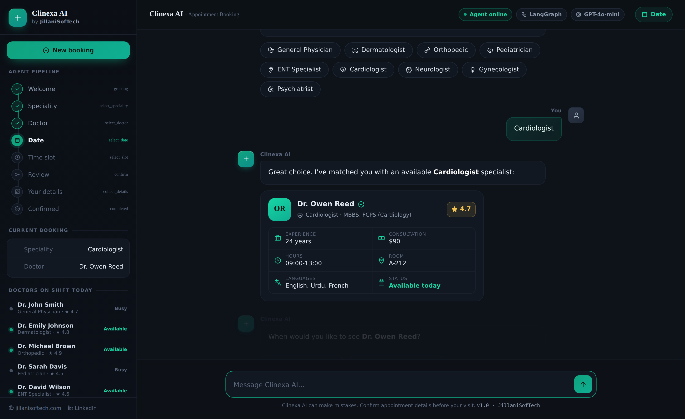
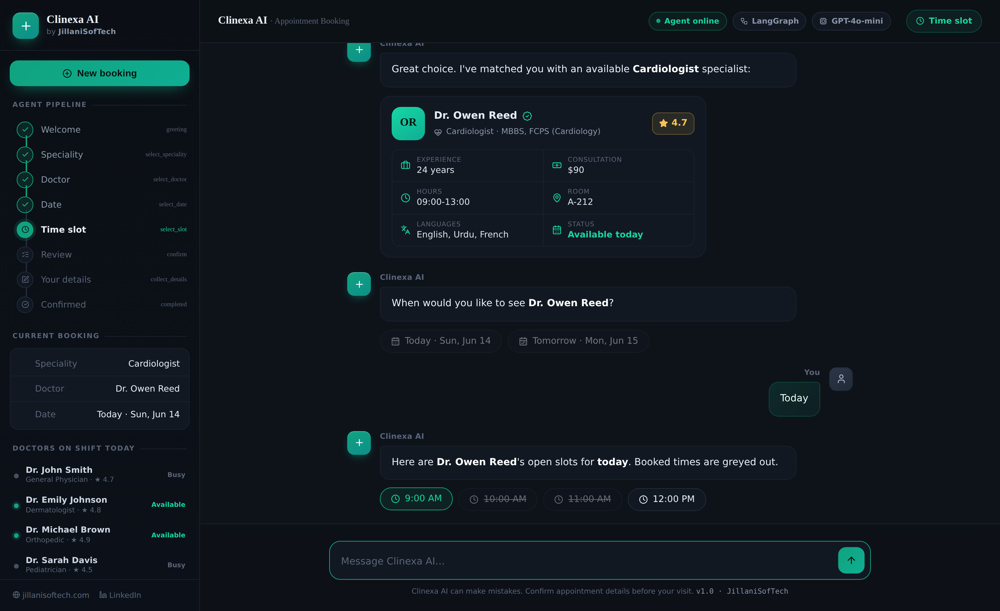
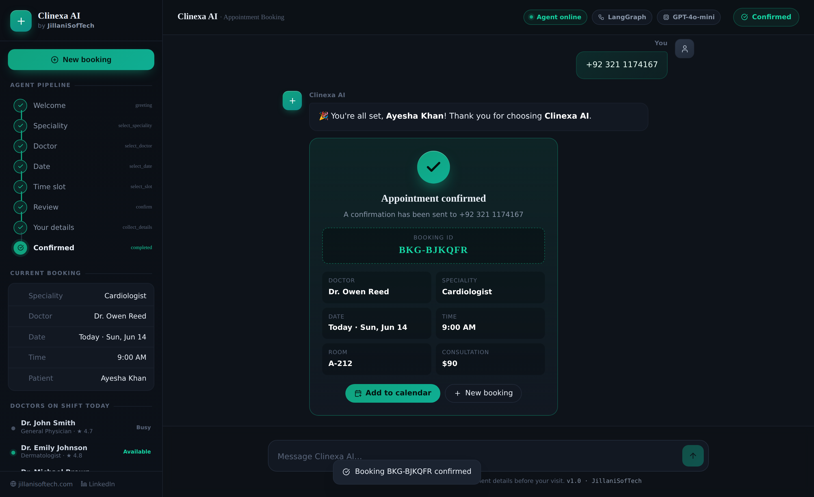

<div align="center">

# 🏥 Clinexa AI — Intelligent Appointment Booking

**A production-grade conversational booking agent that takes a patient from “hi” to a confirmed appointment — entirely through natural conversation.**

Built with **LangGraph · OpenAI GPT-4o-mini · Streamlit · SQLite**

[](https://www.python.org/)
[](https://langchain-ai.github.io/langgraph/)
[](https://platform.openai.com/)
[](https://streamlit.io/)
[](https://www.sqlite.org/)
[](#-license)

[Live walkthrough](#-screenshots) · [Architecture](#-how-it-works) · [Quick start](#️-quick-start) · [Built by JillaniSofTech](#-built-by-jillanisoftech)

</div>

---

## Overview

Most booking bots break the moment a real person talks to them — they follow rigid menus, lose context, and fall apart on anything unexpected. **Clinexa AI** is built the way production systems actually are: as a **stateful LangGraph agent**, not a thin chat wrapper.

It guides a patient through the full journey — greeting, choosing a speciality, getting matched to a specialist, picking a date and time, reviewing, and confirming — handling free-form language at every step, redirecting off-topic messages, and never double-booking a doctor. Every confirmed appointment is persisted with a unique booking ID.

> **60 doctors · 9 specialities · end-to-end agentic booking · zero regex routing.**

---

## 📸 Screenshots

|  |  |
|---|---|
| **Agentic welcome + live pipeline** | **Speciality selection** |
|  |  |
| **Matched specialist profile** | **Date-aware time slots** |
|  |  |

<div align="center">

**Confirmed appointment with booking ID**



</div>

---

## ✨ Features

| | Feature | Description |
|---|---|---|
| 🤖 | **Conversational booking** | Full end-to-end booking via natural language — no forms, no menus |
| 🧠 | **LLM-only routing** | GPT-4o-mini handles all intent classification and entity extraction — zero regex |
| 🔀 | **LangGraph state machine** | Multi-node agentic graph with a robust interrupt / resume pattern |
| 🩺 | **Multi-speciality support** | 60 doctors across 9 specialities, with random specialist assignment |
| 👤 | **Rich doctor profiles** | Rating, years of experience, consultation fee, qualification, languages, room |
| 📅 | **Date-aware availability** | Open slots computed per doctor, per selected date — no double-booking |
| 🛡️ | **Off-topic guardrail** | LLM classifier politely redirects non-medical messages without breaking the flow |
| 💬 | **Session history** | Past bookings and conversations saved in the sidebar |
| 🗃️ | **SQLite persistence** | Doctors, customers and bookings stored locally; schema upgrades itself |
| 🎨 | **Agentic dark UI** | Clean ChatGPT-style interface with a live progress tracker |
| 🖥️ | **Standalone showcase UI** | A self-contained `index.html` (no server needed) for demos and screenshots |

---

## 🧩 How It Works

### LangGraph state machine
The conversation is a directed graph. Every stage is a real node with its own logic, so the flow can never quietly “fall off a cliff.”

```
            ┌──────────┐
            │ greeting │
            └────┬─────┘
                 ▼
        ┌──────────────────┐
        │ select_speciality│
        └────────┬─────────┘
                 ▼
         ┌───────────────┐
         │ select_doctor │
         └───────┬───────┘
                 ▼
          ┌─────────────┐
          │ select_date │
          └──────┬──────┘
                 ▼
          ┌─────────────┐
          │ select_slot │
          └──────┬──────┘
                 ▼
            ┌─────────┐        ┌───────────┐
            │ confirm │ ─────▶ │ cancelled │ ─▶ END
            └────┬────┘        └───────────┘
                 ▼
        ┌──────────────────┐
        │ collect_details  │
        └────────┬─────────┘
                 ▼
           ┌───────────┐
           │ completed │ ─▶ booking id saved to DB ─▶ END
           └───────────┘
```

> A rendered version of the live graph is exported to `agents/langgraph_flow.png` via `save_langgraph_flow.py`.

### Routing (`llm_router`)
Each transition is decided by GPT-4o-mini using stage-specific prompts. A deterministic **keyword fast-path** runs *before* the model for critical transitions (confirm / cancel / change slot) to eliminate misrouting on the highest-stakes steps.

### Guardrail (`is_on_topic`)
A lightweight LLM classifier checks whether the latest input is on-topic for the current stage. Off-topic messages get a courteous redirect — the booking state is preserved.

### Entity extraction
Every node has a dedicated extraction prompt that pulls structured values (speciality, date, time slot) out of free-form input, with graceful fallback prompts when a value isn’t recognised.

### Built for real users
Interrupt-and-resume handling, deterministic fast-paths, retries on model failures, and a DB layer that **migrates its own schema** without losing a single booking.

---

## ⚙️ Quick Start

> Requires Python 3.10+ and an OpenAI API key.

```bash
# 1. clone
git clone https://github.com/<your-username>/clinexa-ai.git
cd clinexa-ai

# 2. create + activate a virtual environment
python -m venv .venv
.venv\Scripts\activate          # Windows
# source .venv/bin/activate     # macOS / Linux

# 3. install dependencies
pip install -r requirements.txt

# 4. add your key
cp .env.example .env            # then put OPENAI_API_KEY=sk-... inside

# 5. run the app  (always from the project root)
streamlit run app.py
```

The SQLite database is **created, seeded and upgraded automatically** on first run — no manual step. The app opens at `http://localhost:8501`.

### Run the standalone showcase UI
`index.html` is a fully self-contained interface for demos and screenshots — no server required.

```bash
# just double-click index.html, or serve it locally:
python -m http.server 8000 --bind 127.0.0.1
# open http://localhost:8000/index.html
```

---

## 🗂️ Project Structure

```
clinexa-ai/
├── agents/
│   ├── booking_agent.py          # LangGraph agent — nodes, routing, state machine
│   └── save_langgraph_flow.py    # Export the live graph as a PNG
├── data/
│   ├── db.py                     # Schema, seed roster, profile generation, queries
│   └── clinic.db                 # SQLite database (auto-created + auto-migrated)
├── services/
│   ├── booking_service.py        # Slot availability, customer + booking creation
│   └── doctor_service.py         # Doctor lookup, profiles, time-slot generation
├── ui/
│   └── chat_ui.py                # Streamlit UI — sidebar, chat, progress, history
├── test/
│   ├── test_agent.py             # Agent flow tests
│   └── test_service.py           # Service-layer tests
├── assets/                       # README screenshots
├── index.html                    # Standalone showcase UI (Bootstrap + vanilla JS)
├── app.py                        # Entry point
├── requirements.txt              # Python dependencies
├── .env.example                  # Environment template
└── README.md
```

---

## 🗄️ Database

The `doctors` table carries a full professional profile, generated deterministically from each doctor’s id (so the data is realistic, reproducible, and trivial to expand).

```sql
-- 60 doctors pre-seeded across 9 specialities
doctors (
  doctor_id, doctor_name, speciality, office_timing,
  experience_years, rating, consultation_fee,
  qualification, languages, room_no
)

-- created on first booking
customers (customer_id, name, phone)

-- one row per confirmed appointment
bookings (
  booking_id, doctor_id, customer_id,
  appointment_date, appointment_time, status
)
```

**Specialities:** Cardiologist · Dermatologist · Neurologist · Orthopedic · Pediatrician · Gynecologist · ENT Specialist · General Physician · Psychiatrist

**Self-upgrading schema:** on startup, `init_db()` detects whether the database predates the enriched profile columns and rebuilds only the static `doctors` table — `customers` and `bookings` are never touched.

### Extending the data
- **Add a doctor** → append one row to `SEED_DOCTORS` in `data/db.py`; rating, fee, experience, room, etc. are generated automatically.
- **Add a speciality** → add an entry to `SPECIALITY_META`, add some doctors, and add a matching chip in `index.html`.
- **Change how profiles are generated** → edit the single `_enrich()` function.

---

## 🛠️ Tech Stack

| Layer | Technology |
|---|---|
| Agent orchestration | LangGraph 0.2+ |
| LLM | OpenAI GPT-4o-mini |
| App UI | Streamlit |
| Showcase UI | HTML + Bootstrap 5 + vanilla JS |
| Database | SQLite (`sqlite3`) |
| State checkpointing | LangGraph `MemorySaver` |
| Env management | `python-dotenv` |

---

## 🚀 Roadmap

- [ ] Multi-doctor selection UI (pick from all specialists in a speciality)
- [ ] SMS / email confirmation via Twilio / SendGrid
- [ ] Admin dashboard — view, cancel, reschedule bookings
- [ ] Fine-tuned routing model to replace GPT-4o-mini
- [ ] Docker deployment config
- [ ] Persistent session storage (PostgreSQL / Redis)

---

## 👤 Built by JillaniSofTech

**JillaniSofTech** builds production AI systems for SaaS, FinTech, LegalTech, HealthTech and operations teams — RAG platforms, AI agents, LLM SaaS products, workflow automation, MLOps and LLMOps.

**Muhammad Ghulam Jillani** — Full Stack AI Engineer · Lead AI / Data Scientist · 24x LinkedIn Top Voice in AI · Top Rated Plus on Upwork.

- 🌐 Website — [jillanisoftech.com](https://jillanisoftech.com/)
- 💼 LinkedIn — [Company](https://www.linkedin.com/company/jillanisoftech/) · [Profile](https://www.linkedin.com/in/jillanisofttech/)
- 🧑‍💻 Upwork — [Top Rated Plus](https://lnkd.in/e78fNHex)
- 📂 Portfolio — [View work](https://lnkd.in/dv5tCb92)
- 📅 [Book a free consultation](https://lnkd.in/emns3fF8)
- 📧 m.g.jillani@jillanisoftech.com

> If your team is buried in manual scheduling, intake, or repetitive back-office work, this is the kind of system we build — production-ready, not a prototype.

---

## 📄 License

Released under the **MIT License**. See [`LICENSE`](LICENSE) for details.

<div align="center">

**⭐ If this project is useful to you, consider starring the repo.**

*Clinexa AI · LangGraph + GPT-4o-mini · JillaniSofTech*

</div>
